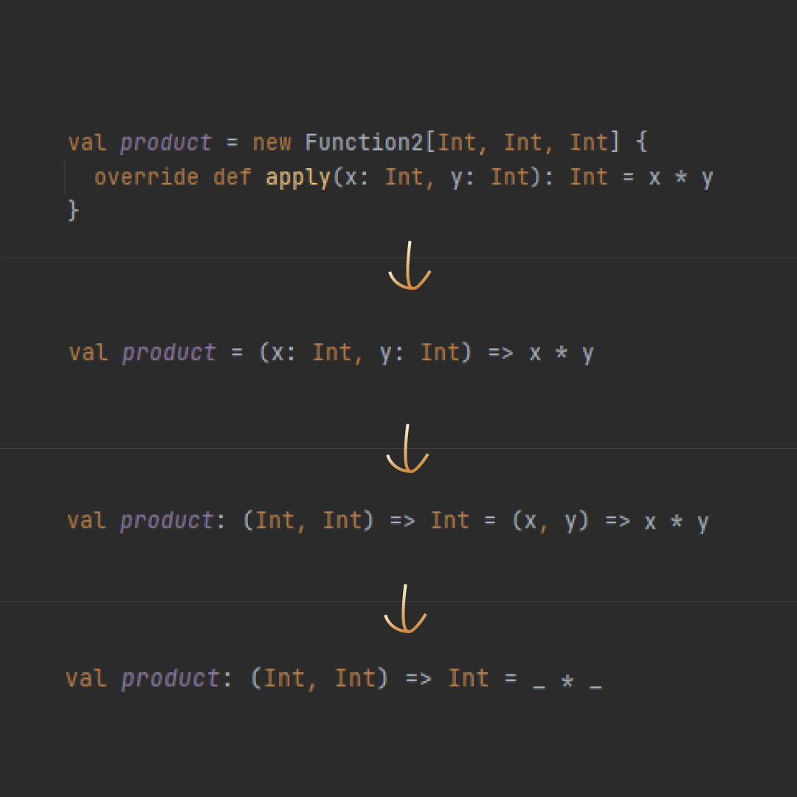

# Scala Start

## VS Code keybindings

- `Ctrl + Shift + P` -> `Preferences: Open Keyboard Shortcuts` -> `metals.run-current-file` -> set `Shift + Enter`

## Notes

- a block of code returns the last expression
- if a function has a name `getSomething`, can conventionally rename it to `something`
- values calculation - [src](https://stepik.org/lesson/460611/step/5?unit=451205)
  - `def f(x: Long): Unit` -> call by value
    - value calculated before function call
      - good: calculated only once
  - `def f(x: => Long): Unit` -> call by name
    - value calculated inside function
      - good: not calculated if unused in function body

- can declare functions inside functions
  - a wrapper and a recursive subfunction

    ```scala
    def wrapperFun(_*): T = {
        def recursiveFun(_*, acc: T) = {
                // do recursive calculation
            }

        recurciveFun(_*, initialAccValue)
    }
    ```

- tail recursion - accumulate results in a function's parameter to avoid stack overflow
  - function design - [src](https://stepik.org/lesson/460612/step/6?unit=451206)
  - can set default accumulator value
    - `def loop(x: Int, accumulator: Int = 1)`
  - can verify tail recursiveness

    ```scala
    import scala.annotation.tailrec
    // ...
    @tailrec
    def loop(x: Int, accumulator: Int = 1): Int = {
    ```

- run with reload on changes - [src](https://stackoverflow.com/a/26144534)
  - `~runMain week1.StringOperations`

## week 3

- use `val` to make a class constructor argument available from the outside - [src](https://stepik.org/lesson/460613/step/3?unit=451207)

  ```scala
  class SomeClass(a: Int, b: Int, val c: Int) {
    def someFunc(): Int = b
  }
  ```

- class body is just a block
- can access anything defined in the class body - [src](https://stepik.org/lesson/460613/step/5?unit=451207)
- when an instance of a class is created, all instructions in its block are executed - same src

- use `this.parameter` to refer to a class parameter, not to a class method parameter - [src](https://stepik.org/lesson/460613/step/8?unit=451207)

- method overloading is possible if two class methods have different signatures and or types - [src](https://stepik.org/lesson/460613/step/9?unit=451207)
  - `getId: String` and `getId(name: String): String`

- can overload constructors via `def this` - [src](https://stepik.org/lesson/460613/step/10?unit=451207)

## Objects

- create objects to store data - like namespace - [comment](https://stepik.org/lesson/463103/step/1?discussion=4003749&reply=4245066&unit=453728)

- Objects are `Singleton objects`, meaning that there exists a single object
  - values of vals storing the same object will be equal: `a == b` - [src]([src](https://stepik.org/lesson/463103/step/3?unit=453728))
- Should not compare instances of a class like `a == b`
  - This will be `false`
- Actions inside object body are run only on declaration, because it's also the definition

  ```scala
    object A {
      val a: String = "value a"
      println("object A")
    }

    val aVal = A
    val anotherVal = A

    println(aVal.a)
    println(anotherVal.a)
  ```

### Companions

- Object and class with the same name defined in a single file - [src](https://stepik.org/lesson/463103/step/4?unit=453728)
  - companion object
- can create `apply` in a companion object to use more complex constructors - [src](https://stepik.org/lesson/463103/step/5?unit=453728)

### Inheritance

- a child class `extends` a parent class - [src](https://stepik.org/lesson/463104/step/1?unit=453729)
- class field modifiers: - [src](https://www.jesperdj.com/2016/01/08/scala-access-modifiers-and-qualifiers-in-detail/)
  - private - available to an companion object, but not to child classes
  - protected - available to a child class, not available from outside
  - no modifier - available from outside
- override in a constructor: - [src](https://stepik.org/lesson/463104/step/7?unit=453729)
  - `class A(override val b: String)`
- can use `super`
- polymorphism - [src](https://stepik.org/lesson/463104/step/9?unit=453729)
- prohibit overriding - [src](https://stepik.org/lesson/463104/step/11?unit=453729)
  - `final class_member` - prohibit `override` `class_member`
  - `final class` - prohibit class extension
  - `sealed` - allow class extensions in current file, but not in other files
- abstract class - abstract fields have no bodies - [src](https://stepik.org/lesson/463104/step/12?unit=453729)
  - definitions in child classes
- anonymous class - for single-time usage - [src](https://stepik.org/lesson/463104/step/13?unit=453729)
- `trait` - like typeclasses, but have no type parameters - [src](https://stepik.org/lesson/463104/step/15?unit=453729)
  - can set multiple traits

    ```scala
    class A () extends B with Trait1 with Trait2 {}
    ```

### Exceptions

- Nothing is at the bottom of the scala type system - [src](https://json.schemastore.org/github-workflow.json)
  - Nothing is anything - [src](https://stepik.org/lesson/463107/step/4?discussion=3751279&reply=3909920&unit=453732)

- need to accommodate the type of try and catch - choose the least general

  ```scala
    val potentialException = try {
    intOrNothing(false)
  } catch {
    case e: RuntimeException => println("RTE is here")
  } finally {
    println("I will be there no matter what")
  }
  ```

- `Int.MaxValue`  is the largest number - [src](https://stepik.org/lesson/463107/step/6?unit=453732)
  - any number larger than it will have a negative sign

### Generics

- type parameters start with an uppercase letter - [src](https://stepik.org/lesson/771289/step/3?unit=773730)

  ```scala
  class SomeClass[T] {
    def someFunc(aVal: T): Unit = println(s"generic type is used")
  }
  ```

  ```scala
  def randomItem[A](items: List[A]): A = {
    val randomIndex = util.Random.nextInt(items.length)
    items(randomIndex)
  }

  ```

- Generics are for classes, traits, methods, not for objects

- Upper and lower type bounds: - [src](https://stepik.org/lesson/771289/step/5?unit=773730)
  - `T <: Vehicle` - `T` is a subtype of `Vehicle`
  - `T >: Vehicle` - `T` is a supertype of `Vehicle`
  - combined:  `class Parking[T >: Bicycle <: Vehicle](val vehicle: T)`

### Variance

- Variance problem: if `A` `extend`s `B`, will `List[A]` `extend` `List[B]`?
  - `+А` - instance will be a supertype of a type parameter
  - `-А` - instance will be a supertype of a type parameter
- like `Foo[+A]` - [src](https://docs.scala-lang.org/tour/variances.html)
  - `A <: B` - `A` is a subtype of `B`  
  - `A <: B`, class `Cov[+T]` => `Cov[A] <: Cov[B]`
  - `A >: B`, class `Contra[-T]` => `Contra[B] >: Contra[A]`
- an invariant type parameter requires usage of this parameter

### Syntactic sugar

- notations - better use `.` - [src](https://stepik.org/lesson/464328/step/3?unit=454974)
  - infix notation: `println(bob worksAs "Developer")` - if a method takes only one parameter
  - postfix notation `println(bob speaksEnglish)` - if a method doesn't take any parameters
- operators like `+`: - [src](https://stepik.org/lesson/464328/step/4?unit=454974)
  - are methods accessible via:
    - `.`:  `1.+(2)`
    - infix notation: `bob & alice`
  - can be overriden
- there are unary operators - [src](https://stepik.org/lesson/464328/step/6?unit=454974)

### Case classes

- avoid ordinary classes - [src](https://stepik.org/lesson/463106/step/1?unit=453731)
  - case class features - [src](https://stepik.org/lesson/463106/step/1?discussion=3913327&reply=3916500&unit=453731)
    - immutable
    - elementwise comparisonaVal = A
  val anotherVal
    - can be copied
    - can be pretty printed
    - its parameters are its fields by default - [src](https://stepik.org/lesson/463106/step/2?unit=453731)
    - has content level equality property - [src](https://stepik.org/lesson/463106/step/4?unit=453731)
      - instance `A` can be compared to instance `B`
    - has a `copy` method - [src](https://stepik.org/lesson/463106/step/5?unit=453731)
      - `val bobsTwin = bob.copy(name = "John")`
    - has a companion object
      - `val alice = Person("Alice", "Engineer") // метод apply в действии`
    -
- put functions and values into traits and objects

## Functional Programming

1. There are traits for functions in Scala

  ```scala
  val res = new Function1[Int, Int] {
    override def apply(x: Int): Int = x * 2
  }
  
  ```

- last parameter is the type of the return value
- there are `Function1 .. Function22`



1. Examples

   - 3 is a bit Haskell-y
   - `val strlen: String => Int = s => s.length()`

1. Currying

  ```scala
  def add(x: Int)(y: Int) = x + y

  println(add(1)(2))
  ```

- usecases - [src](https://stepik.org/lesson/464402/step/3?discussion=5174427&reply=5203868&unit=455048)
  - reduce the number of data traversals
  - make a good alias of a partially applied function

## Scala 3

- [enum](https://docs.scala-lang.org/scala3/reference/enums/enums.html)
  - creates companion objects
- use `val` with HOF - better performance due to immutability

## Design

- Service/Handle pattern - [src](https://www.metalamp.ru/articles/service-handle-pattern)
  - access a `service`, not a concrete function
    - hide concrete implementation behind the handle so that it's easier to substitute the concrete implementation

## Code

- Scala code organization - [src](https://blog.softwaremill.com/how-to-structure-your-scala-application-658168fbb827)
