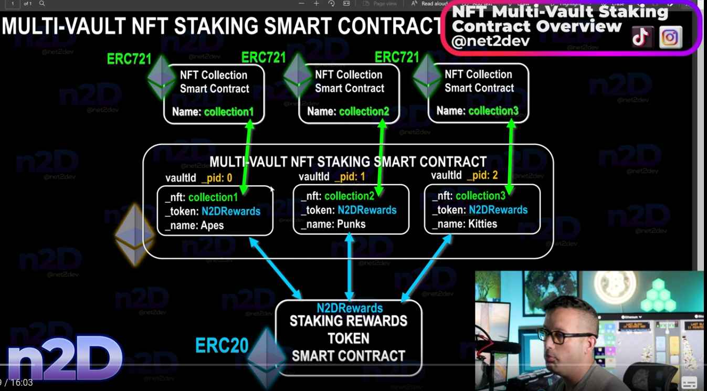

# NFT ERC721 Staking Smart Contract (SC) With ERC20 Token Rewards

## Disclaimer

The work is unfinished

## Run project

1. Install dependencies

  ```sh
  npm i
  ```

1. terminal 1:

    ```sh
    npx hardhat node
    ```

1. terminal 2:

    ```sh
    remixd -s ./ -u http://localhost:8080 --remix-ide package://6fd22d6fe5549ad4c4d8fd3ca0b7816b.mod
    ```

1. Set up Remix IDE - [src](https://remix-ide.readthedocs.io/en/latest/hardhat.html)

1. terminal 3: compile, copy contract addresses into Remix IDE
   - Deploy and run -> At Address

    ```sh
    npx hardhat run scripts/deploy.ts --network localhost
    ```

## Tutorial

Based on [playlist](https://www.youtube.com/watch?v=i6pPI5phMA0&list=PLLkrq2VBYc1YAIXfxuuh1DohmPZybsELt)

### 1

- ERC 721 NFT will be deposited into an NFT staking SC
  - staking means users put their NFTs into a vault and get a reward
  - this NFT SC will be attached to an ERC20 token SC

3 smart contracts:
    1. `NFT staking` SC - users stake NFTs
    2. `Staking Rewards` SC - ERC20
    3. `NFT Collection` SC - ERC721

Process:
    1. Buyer mints NFT from `NFT Collection` and gets an NFT ID
    2. Buyer stakes NFT in the `NFT Staking`
       - need to verify that ID belongs to **our** NFT collection
    3. NFT is in a Vault
    3. We calculate the period and amount of rewards
    4. NFT staker wants to know her total reward
       - CLAIM
    5. She asks `NFT Staking`
    6. `NFT Staking`
       7. requests `Staking Rewards` to mint rewards tokens
       8. sends `Staking Rewards` destination wallet to deposit these tokens
    9.

### 2

- can set time with literals like `1 weeks` - [src](https://docs.soliditylang.org/en/latest/units-and-global-variables.html#time-units)
- block and transaction properties - [src](https://docs.soliditylang.org/en/latest/units-and-global-variables.html#block-and-transaction-properties)
- function modifiers - [src](https://ethereum.stackexchange.com/a/19391)
  - `public`:
    - all can access
    - **expensive**
  - `external`
    - Cannot be accessed internally, only externally
    - **cheaper**
  - `internal` - only this contract and contracts deriving from it can access
  - `private` - can be accessed only from this contract
- data locations - [src](https://solidity-by-example.org/data-locations/)
  - Variables are declared as either storage, memory or calldata to explicitly specify the location of the data.
    - `storage` - variable is a state variable (store on blockchain)
    - `memory` - variable is in memory and it exists while a function is being called
    - `calldata` - special data location that contains function arguments

### 3

- ERC721 is for non-fungible tokens
- ERC20 is for fungible
- ERC1155 combines multiple types of tokens and is more e fficient
- can hardcode values
- connect the to a folder:
  - Web IDE: `remixd -s ./ -u http://localhost:8080 --remix-ide https://remix.ethereum.org`
  - Remix Desktop `remixd -s ./ -u http://localhost:8080 --remix-ide package://6fd22d6fe5549ad4c4d8fd3ca0b7816b.mod`

- Deployment steps
  1. ERC 721 - NFT collection SC
  2. ERC20 - staking reward SC

### 4

- need to supply other SC addresses into NFT Staking constructor - [src](https://youtu.be/TMIImre5umU?list=PLLkrq2VBYc1YAIXfxuuh1DohmPZybsELt&t=484)

- use hardhat

### 5

- `require` reverts a transaction on false condition

### Multi-vault

- 

## Sample Hardhat Project

This project demonstrates a basic Hardhat use case. It comes with a sample contract, a test for that contract, and a script that deploys that contract.

Try running some of the following tasks:

```shell
npx hardhat help
npx hardhat test
REPORT_GAS=true npx hardhat test
npx hardhat node
npx hardhat run scripts/deploy.ts
```

## Test

- may need to `npm audit fix --force` - [SO](https://stackoverflow.com/a/73027407)
