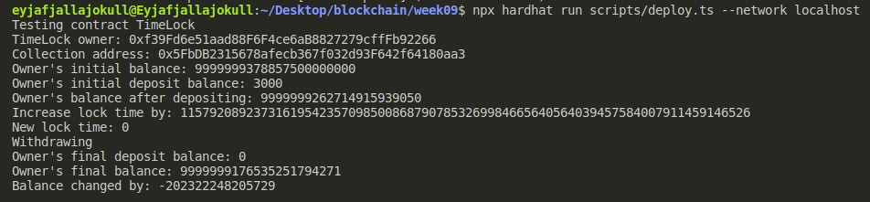
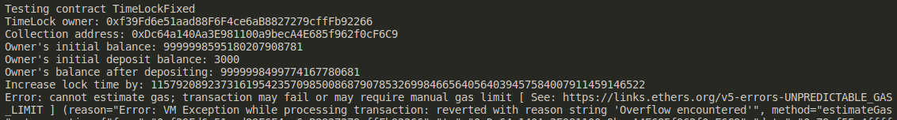

# NFT ERC721 Staking Smart Contract (SC) With ERC20 Token Rewards

## Disclaimer

The work is unfinished

## Run project

1. Install dependencies

  ```sh
  npm i
  ```

1. terminal 1:

    ```sh
    npx hardhat node
    ```

1. terminal 2

    ```sh
    npx hardhat run scripts/deploy.ts --network localhost
    ```

## Solution

The problem was that `increaseLockTime` allows overflows in the original SC.



To fix this, I checked for overflow in `increaseLockTime` (see [TimeLockFixed](./contracts/TimeLockFixed.sol))



## Sample Hardhat Project

This project demonstrates a basic Hardhat use case. It comes with a sample contract, a test for that contract, and a script that deploys that contract.

Try running some of the following tasks:

```shell
npx hardhat help
npx hardhat test
REPORT_GAS=true npx hardhat test
npx hardhat node
npx hardhat run scripts/deploy.ts
```

## Test

- may need to `npm audit fix --force` - [SO](https://stackoverflow.com/a/73027407)
